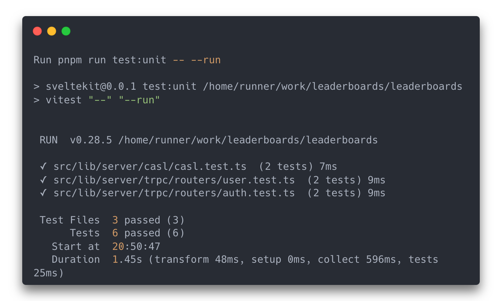
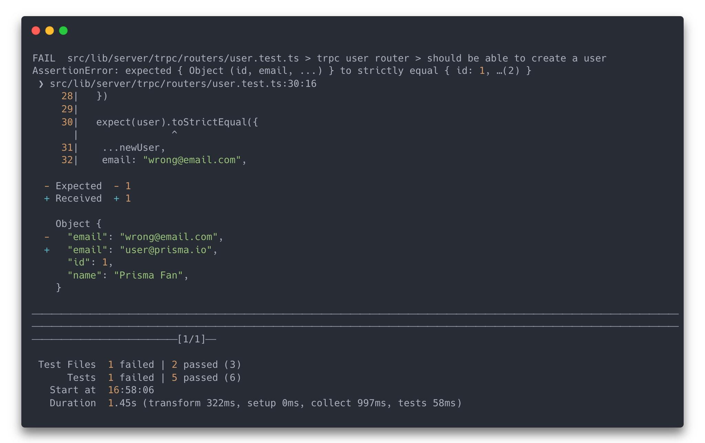
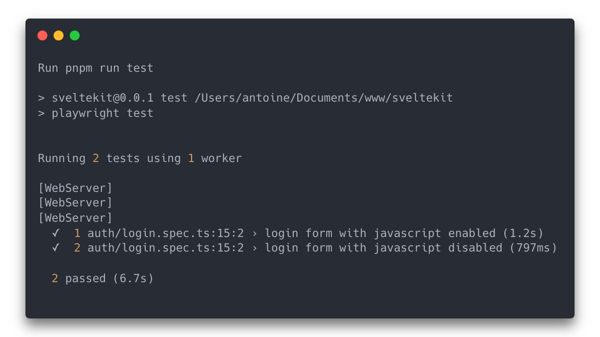
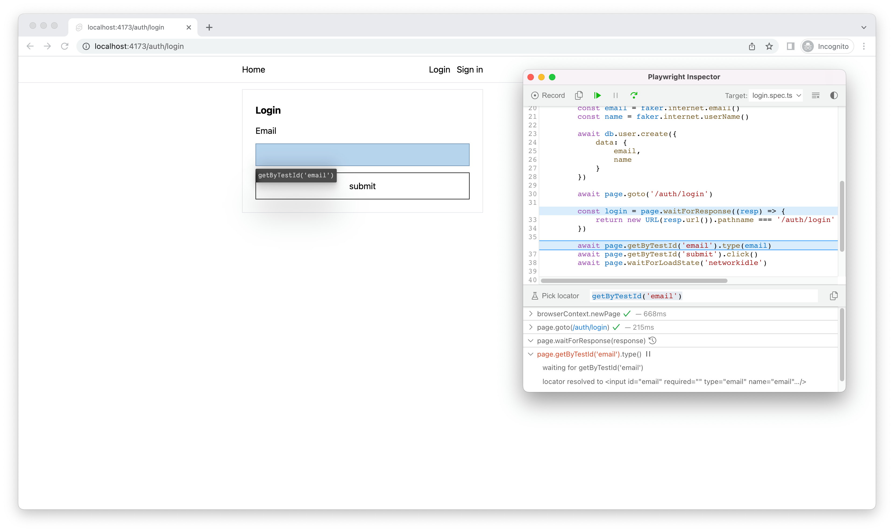

# Requirements ✅

Before delving into the details of various libraries and frameworks, it is important to establish the necessary requirements. Any technology that fails to meet these requirements will either be excluded from consideration or not mentioned in this paper.

## Full-stack meta-framework ✅

Until now in this paper, I mentioned back-end and front-end as two distinct entities. However, many solutions these days take care of the entire stack to enable end-to-end type safety, routing, and other features. These solutions are often referred to as meta-frameworks. For this project, I will be only be considering so called full-stack meta-frameworks.

## TypeScript ✅

To ensure type safety in web applications, it is recommended to use TypeScript for both the backend and frontend. This eliminates concerns about potential issues arising from differences in the type systems of two languages. Additionally, there are several technologies, such as Prisma and tRPC, that rely on TypeScript being used throughout the entire stack to facilitate type safety. These technologies will be discussed in more detail later in this paper.

While it is possible to use WebAssembly with a language like Rust to achieve type safety, I believe that the benefits of using TypeScript outweigh those of using WebAssembly. TypeScript has a larger community and a more mature ecosystem, making it a more practical choice for web application development.

## No manual type generation ✅

For this project, tools that require manual code generation for type safety will not be considered. This is because such tools necessitate a build step, which can increase the complexity and difficulty of maintaining the project. Manual code generation refers to the need to manually update type definitions when the shape of data changes on one end, as the other end is not automatically aware of the change. This is often the case with technologies such as GraphQL and Swagger.

While this approach can work, it is prone to errors and can be tedious to maintain. For this reason, I have chosen not to use any technology that requires manual type generation. However, as we will see later in this paper, it may not be possible to completely avoid type generation.

## Type safe queries ✅

Type safe queries refer to the ability to transfer data from the database to the frontend in a type safe manner. This is a crucial aspect of achieving end-to-end type safety, which is one of the requirements of this project. It also allows for a single source of truth for the data, improving the maintainability of the project. All of the technologies discussed later in this paper will support type safe queries.

## Type safe mutations ✅

Type safe mutations can be thought of as the reverse of type safe queries: the ability to send data from the client back to the database in a type safe manner. This is typically more challenging to implement than type safe queries. The approach taken by framework authors to achieve this can vary and may not always be widely accepted. As a result, some frameworks do not support type safe mutations.

## Server side rendering ✅

Although not directly related to end-to-end type safety, server-side rendering is a requirement for this project. This technique involves the server sending the HTML of a page to the client, rather than sending JavaScript code that generates the HTML. Server-side rendering can improve SEO and performance.

# Nice to haves ✅

While the previously mentioned requirements are essential, the following attributes are desirable but not mandatory.

## Progressive enhancement ✅

Progressive enhancement is a web design strategy that prioritizes core web page content. It begins with the basic content and adds layers of presentation and features based on the user’s browser and internet connection. The goal is to make web applications accessible to a wide range of browsing situations. Progressive enhancement is not a specific set of features, but rather a philosophy that can be applied to any web application. Some frameworks prioritize this approach, while others do not.

This approach differs from graceful degradation, which starts with the optimal experience and reduces it for older or less capable browsers.

## Progressively enhanced forms ✅

Earlier, we discussed the use of mutations as a means for clients to transmit data to the database via the backend. While there are multiple ways to accomplish this using JavaScript, browsers have a built-in method: forms. Progressively enhanced forms are forms that use JavaScript to improve the user experience, such as by providing live validation of input. These forms can send data natively to the backend, but if JavaScript is available, it takes over to prevent full page navigation. This feature is desirable because it offers a fallback for users without JavaScript while still providing an enhanced experience for those with it enabled. However, you may be wondering if all users have JavaScript enabled.

## As little JavaScript as possible ✅

Contrary to popular belief, not everyone has JavaScript enabled in their browsers. This is demonstrated by the website [Everyone has JavaScript, right?](https://www.kryogenix.org/code/browser/everyonehasjs.html). As a result, it is important to minimize the use of JavaScript and ensure that as many features as possible can function without it.

## Good hydration strategy ✅

Hydration refers to the process of transforming a static web page into a dynamic one. When a JavaScript framework supports hydration, it can generate a static HTML page that is sent to the client and then converted into a dynamic page by the same framework. However, this process can be resource-intensive, as it requires the framework to be loaded twice: once on the server and once on the client. As a result, it is important to have an effective hydration strategy that minimizes the amount of JavaScript loaded or, as we will see later with one of the frameworks discussed in this paper, avoids hydration altogether.

# Database ORM ✅

The first technologies I will discuss are database ORMs (Object Relational Mapping libraries). These libraries allow you to interact with a database using an object-oriented approach. As specified in the requirements, we also want a type-safe query system, where the ORM only permits operations that are consistent with the shape of the data in the database. To simplify matters, I have limited my focus to SQL databases. As a result, I will be discussing two ORMs that support type-safe queries: Prisma and Drizzle ORM.

## Prisma ✅

Although Prisma supports a wide range of databases, including noSQL databases, I will only be discussing its use with the SQLite adaptor. Prisma is a mature project with a large community and extensive documentation. It is user-friendly and offers many features, including the ability to generate a type-safe JavaScript client. However, it does have some drawbacks. Firstly, it requires a build step. As mentioned earlier, we want to avoid manually generating types. However, this is less of a concern for the database, as its shape changes less frequently than the data exchanged between the backend and frontend. Another drawback of Prisma is its slow cold starts when used in edge or lambda environments. This is due to its historical goal of supporting multiple languages, resulting in a large Rust binary that must be executed.

However, edge and lambda performance is not a concern for this project.

## Drizzle ORM ✅

Drizzle ORM is worth mentioning in this paper, despite being relatively new software as of April 2023. According to its homepage, Drizzle ORM is a “TypeScript ORM for SQL databases designed with maximum type safety in mind.” Its main advantage is that the database schema is defined directly using TypeScript, allowing types to be automatically inferred when used by the backend. This approach eliminates the need for a build step to achieve type safety from the database.

However, Drizzle ORM is still in its early stages and lacks many features. As a result, I will not be using it for this project.

# Meta-frameworks ✅

In this section, we will examine the frameworks that were investigated during the research for this paper. The frameworks are presented in the order in which they were explored.

## Sample application ✅

To evaluate the different technologies, I have implemented a sample application using each of them, at least partially. The sample application is a simple to-do list that allows users to create, read, update, and delete their own to-dos. Users can log in and their to-dos are saved to a database.

## Nuxt 3 ✅

The first framework on the list is Nuxt 3. Originally launched in 2018, Nuxt is a meta-framework built on top of Vue.js, a popular JavaScript UI framework created by Evan You in 2014. I have chosen to discuss Nuxt first because I am most familiar with it, having used it professionally for the past two years. Nuxt provides a great out-of-the-box experience as it supports TypeScript with no additional configuration required.

### Pros: TypeScript 👍 ✅

TypeScript is configured out-of-the-box, eliminating the need for any additional setup. This is a significant advantage, as it allows developers to start coding immediately without having to worry about configuring TypeScript, which can be a cumbersome process. The framework also supports TSX, which is beneficial for Vue developers who are familiar with JSX, the HTML-like syntax used by React.

### Pros: Ease of use 👍 ✅

Nuxt is highly user-friendly, thanks to its foundation on the Vue framework. It allows for the consolidation of JavaScript, HTML, and CSS within single files. In addition to file-based routing, which is a common feature among the frameworks discussed in this paper, Nuxt also offers a range of built-in features that enhance the user experience, such as automatic component importing.

### Pros: Iso-morphic routing 👍 ✅

Nuxt supports isomorphic routing, which allows the same route to be utilized for both server-side and client-side rendering. This offers a significant advantage to developers as it enables them to write a single codebase without concern for where it will be executed.

### Cons: Forms 🚫 ✅

As explained in an earlier section, one of the nice-to-have features of this project is the ability to progressively enhance forms. However, due to the way Nuxt handles routing, it may not be possible to have forms send data to the backend without JavaScript.

## Astro ✅

Astro is a unique framework compared to others presented in your paper. It can be considered as a meta-framework that isn’t built on top of another UI framework. Instead, Astro delivers static applications that can be enhanced with interactive features using UI frameworks of your choice such as React, Vue, Svelte, etc.

### Pros: Easy type safe queries 👍 ✅

Type-safe queries are easy to use in Astro. Astro feels a lot like using PHP where back-end code can live alongside HTML, making it simple to call a database query and use the result in the HTML.

### Pros: Islands 👍 ✅

Astro is the only framework in your paper that uses an islands architecture. This architecture relates to hydration mentioned in the previous section. Islands are a way to hydrate subsections of an HTML page rather than the entire page itself. This is important because in real applications, interactive sections of your applications are usually very small compared to the entire page. This means that you can hydrate only the interactive sections of your page, which is much more efficient than hydrating the entire page.

### Pros: No JavaScript by default 👍 ✅

Astro’s approach to client-side JavaScript is interesting. By default, Astro doesn’t include any JavaScript on the client. This means you can enable JavaScript on a per-component basis. If there’s no interactivity on a given page, there will be no JavaScript sent at all.

### Cons: Difficult interactivity 🚫 ✅

Astro was primarily designed as a static site generator. While the framework offers great developer experience when it comes to querying data when the page is rendered on the server, Astro doesn’t include any nice built-in way to send data back to the server. Additionally, Astro doesn’t offer a way to refresh data fetched on a given page without having to rely on third-party JavaScript. It can also be difficult to share state across components or to do progressive enhancement. While Astro is great for heavily content-driven websites, its features can feel limiting when it comes to building more complex applications.

## Remix ✅

Remix is a meta-framework that’s built on top of React. It was created by the team behind React Router and was recently acquired by Shopify. Remix is an interesting framework as it pioneered the progressive enhancement movement that’s currently happening in the JavaScript community.

### Pros: Progressive enhancement 👍 ✅

Remix has progressively enhanced routing and forms out of the box. This means that if JavaScript is disabled, the user will still be able to navigate the site, receive data and submit forms. This is a huge advantage as it allows you to build a fully functional website without having to worry about JavaScript.

### Pros: Disable JavaScript 👍 ✅

If a given page doesn’t need interactivity, it’s possible to disable JavaScript entirely. While this isn’t as granular as Astro, it’s still a nice feature to have.

### Cons: Manual type safety 🚫 ✅

While Remix has great type safety, it’s not automatic. This means that you have to manually type your routes and forms. This can be a bit cumbersome, especially if you have a large application. It’s also prone to error as nothing prevents you from writing code that doesn’t match the type you’ve defined or that tries to load data that will never be available, resulting in runtime errors.

### Cons: Only SSR 🚫 ✅

Remix only supports server-side rendering. This means that if you want to build a single-page application, you’ll have to use a different framework. You also cannot pre-render your pages, which can be a problem if you have a lot of content that doesn’t change often.

## Sveltekit ✅

Sveltekit is a meta-framework built on top of Svelte, a UI framework that was created by Rich Harris in 2016. Sveltekit is a relatively new framework, having been released in December 2022 and in some ways, has a lot of similarities with Remix.

### End to end type safety 👍 ✅

Sveltekit has excellent type safety. This is because SvelteKit automatically generates types based on the shape of your application. This means your routes are aware of their parents, the data they receive, and the data they return. This is a huge advantage as it means that you can’t write code that doesn’t match the type you’ve defined.

### Pros: Progressive enhancement 👍 ✅

Sveltekit has progressively enhanced routing and forms, just like Remix. This means that if JavaScript is disabled, the user will still be able to navigate the site, receive data and submit forms.

### Props: Multiple rendering paradigms 👍 ✅

SvelteKit provides multiple rendering paradigms on a per-page basis, which means you can choose to render a page only on the server, only on the client, or both. Interestingly, you can even decide to render it on neither of them, resulting in a blank page.

### Cons: Typed Components 🚫 ✅

Typing Svelte components can be challenging due to its unique syntax. Every component has to be typed in the Svelte way, which can be a bit cumbersome. Additionally, some features are not supported by the compiler, which requires the use of workarounds.

### Cons: Svelte 🚫 ✅

This is a personal opinion, but I find Svelte difficult to use with TypeScript. I also prefer a more explicit approach and don’t like when a framework hides its reactivity behind compiler magic. Additionally, Svelte requires your code to be written into .svelte files and the syntax is unique to .svelte files and cannot be used outside of them.

## Qwik City ✅

In my opinion, Qwik City is the most exciting framework in your paper. It’s a meta-framework built on top of Qwik, a UI framework created by the team behind Angular. Qwik’s main benefit is its unique approach to rendering. As of March 2023, Qwik is still a very new and hot release candidate.

### Pros: Type safe queries 👍 ✅

Qwik City provides type-safe queries out of the box. By default, they only run on the server, making it easy to query a database without having to worry about security. The types are automatically inferred and can be reused across the application.

### Pros: Type safe mutations 👍 ✅

Qwik City also provides type-safe mutations and even supports Zod, a popular input validation library. Qwik City’s mutations can also be used directly with forms, making them work with progressive enhancement. This guarantees that if JavaScript is disabled, the user will still be able to submit forms and have their input validated. Qwik City is the only framework in this paper to support this feature.

### Pros: Resumability 👍 ✅

Qwik has a unique approach to rendering. It uses a concept called resumability, which means that the rendering process can be paused and resumed at any time. This is a huge advantage as it means that you can render a page on the server and then resume rendering on the client. This is in opposition to hydration, which renders the application twice, once on the server and once on a client. Resumability has huge performance benefits and also eliminates the need for various rendering options. While Qwik is still a small framework, I truly believe that resumability is the future of rendering.

### Pros: Familiar syntax 👍 ✅

While Qwik brings a lot of new concepts to the table, it also has a very familiar syntax to React developers. This eases adoption and makes it easy to migrate from React to Qwik. Qwik also has the possibility to directly import React components, turning them into islands.

### Cons: Small ecosystem 🚫 ✅

While this isn’t really an issue with Qwik but a problem inherent to new projects, Qwik is still a very young framework. This means that there aren’t a lot of libraries available yet. However, the framework is still in active development and I’m sure that the ecosystem will grow over time.

# Other meta-frameworks

The following meta-frameworks were not covered in this paper.

## Next 13 ✅

Next.js is a meta-framework built on top of React. It was created by Vercel and is currently the most popular React framework in the world. It wasn’t covered in this paper because React is currently in a transition period. The core React team is currently working on a new concept they call React Server Components (RSC), which is a new way to render React applications. RSC is still in the early stages of development and is not yet ready for production. Next.js is currently in a transition period as well, as it is currently working on integrating RSC into its framework. This means that Next.js is currently in a state of flux and is not yet ready for production. For these reasons, it wasn’t covered in the paper.

## Solid Start ✅

Solid Start is a meta-framework built on top of Solid. Solid is a UI framework created by Ryan Carniato in 2021. Solid is a relatively new framework but has been gaining a lot of traction as of recently. However, it wasn’t covered in the paper because it is still in beta.

## Angular ✅

Angular has not been tested in this paper. This is because I don’t think Angular has been evolving in the right direction. The learning curve is also too high and the framework is too opinionated. I think that Angular is a good framework for large companies, but for smaller companies, I think it’s better to use a framework that is more flexible and easier to learn.

However, 2023 could be a breakthrough year for Angular as it plans to bring signals, a different reactivity paradigm recently popularized by Solid and could drastically simplify the framework and improve performances. This is why I think it’s important to keep an eye on Angular in 2023.

# Third party libraries

## tRPC ✅

As we’ve seen with the frameworks presented earlier, some support type-safe mutations, others support mutations but without type safety and some don’t support mutations at all. This is a problem because it means that you have to write your own mutations and queries, which can be a lot of work. This is why I think it’s important to have a framework that supports type-safe mutations and queries out of the box. However, it is also possible to delegate this work to a third party. This is where tRPC comes in.

tRPC stands for TypeScript Remote Procedure Calls. It’s a library that allows you to write type-safe queries and mutations without having to generate types. It’s a very simple library that can be used with any framework. This is why for some of the frameworks listed above, I used tRPC to implement type-safe queries and mutations instead of relying on the framework.

## Zod ✅

As mentioned in the framework section about Qwik, Zod is a popular input validation library. It allows you to validate unknown user inputs before doing anything with them. This is important because it prevents users from submitting malicious data and guarantees that the data is in the correct format. This is why I think it’s important to use Zod or similar libraries to validate user inputs and this is why Zod has been used in this paper.

# Testing ✅

Testing is another important aspect of a framework. To ensure that the code works as expected, I tested the frameworks with unit tests, end-to-end tests, and continuous integration. While type safety brings safety to the code, it doesn’t guarantee that the code is correct. Therefore, it’s important to test the code to make sure that it works as expected. In this paper, only the SvelteKit implementation has implemented testing.

## Unit testing with vitest

Vitest is a testing framework that allows you to write unit tests. It can test components, functions and supports TypeScript out of the box. In this project, Vitest has been used to ensure buiness logic is correct. For exemple, we could write a test that ensure that when a user tries to login with a wrong email, the HTTP status code returned is 401.

When a test fails, the error message is very clear and easy to understand.

In this exemple, we can see that the code responsible for creating a new user in the database isn't working anymore.

## End to end testing with Playwright

Playwright is an end-to-end testing framework that allows you to test your application in a real browser. We call this end-to-end testing because it tests the application from the user's perspective, effectively testing the database, back-end and front-end simultaneously.

Playwright also have a debug mode that allows you to see what the browser is doing. This is very useful when you want to see what’s going on in the browser. The test can then be played step by step. This is very useful when developing tests.

However, to ensure the consistency of the applications over time, it's not enough to have tests available on the developer's machine. It's also important to have them run on a CI server. This is why I've also implemented continuous integration with Github Actions.

## Continuis integration with Github Actions

Github Actions are Github's own CI/CD solution. They allow you to run tests, deploy applications and do a lot of other things. In this project, I've used Github Actions to run the tests on every push and pull request. This ensures that the code is always working as expected.

# Conclusion
