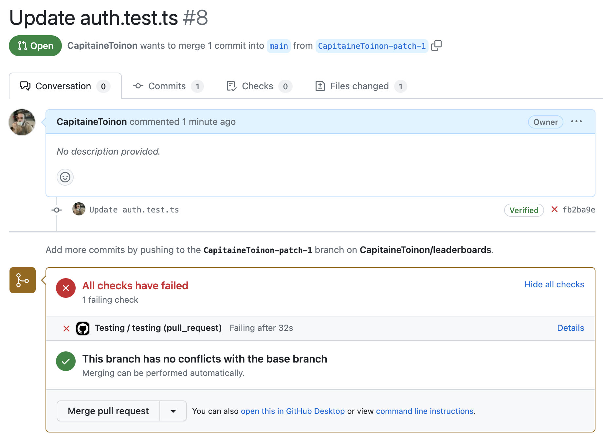
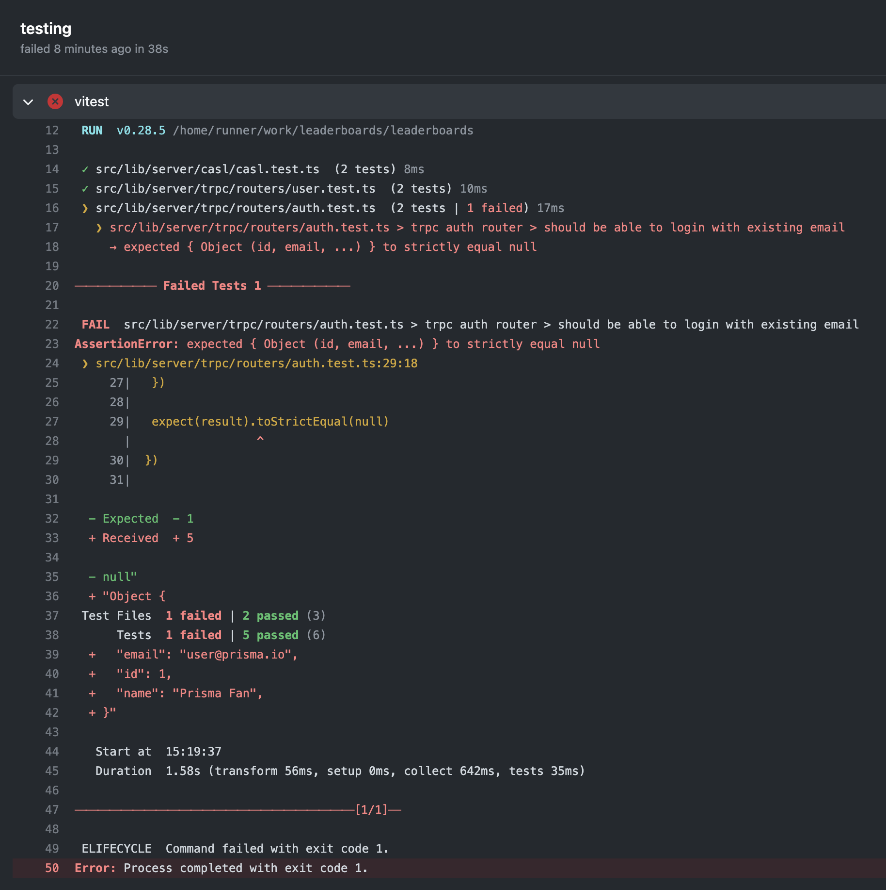

# Travail de semestre

Open Source Leaderboard Project

# Resume

# Introduction

Le speedrun est la pratique de finir un jeu vidéo le plus rapidement possible. Cette discipline dévelopée au début des années 1990 est devenue très populaire ces dernières années. En effet, les jeux vidéo sont de plus en plus complexes et les techniques de speedrun sont de plus en plus complexes. Il existe aujourd'hui plusieurs sites web qui permettent de suivre les records de speedrun. Malheureusement il n'existe aujourd'hui pas de solution open source permettant à n'importe qui de créer son propre site web de speedrun. Ainsi, les speedrunners sont obligés de se tourner vers des solutions propriétaires.

L'objectif de ce projet est de créer une solution permettant de créer des sites web de speedrun open source. Ce site web permettra de suivre les records de speedrun et de créer des classements. Il permettra également aux communautés de créer et partager des guides, tutoriels et diverses informations sur les jeux vidéo concernés.

D'un point de vue technique, l'objectif de ce projet est d'explorer les solutions actuels sur le marché afin de choisir des technologies offrant la plus grande sécurité de developement. En effet, après avoir pu travailler sur des projets complexes

## Acronymes

- SSR: Server Side Rendering
- SSG: Server Side Generation

## But first here as some definitions

Afin de pouvoir définir les besoins de ce projet, il est important de définir les différents termes utilisés dans ce document.

### Hydration

### Progressive enhancement

### others...

### Why having unified language for server and backend?

### Pourquoi pas le web assembly?

## Besoins techniques

### TypeScript

- JavaScript
- Rendu côté serveur et client (SSR)
- end to end type safety

## Nice to have

- Good hydration stategy
- progressive enhancement

To achieve end to end type safetly, this project will use prisma

### Why SSR

- Better SEO
- Better performances

### Why type safety

- ...? Really do I need to convince you on that
- Example of problems that can happen when no end 2 end typesafely
  - ...
- GraphQL? No because:
  - ...
- Swagger? No because:
  - required a build step
  - have to maintain it
  - etc...

### Why progressive enhancement

[Everyone has JavaScript, right?](https://www.kryogenix.org/code/browser/everyonehasjs.html)

## Nuxt 3

Le premier framework que j'ai exploré est nuxt 3. Basé sur le framework Vue.js

### Cons

- Progressive enhancement for forms is really hard
- Hard to disable javascript for unique pages
- Full hydration

## Astro

Because the technology is awesome, very easy to use, feels like using PHP.

### Pros

- Islands (low javascript shipped)
- Not tied to a framework (can use React, Vue, Svelte, etc)

### Cons

- Was primarly designed as a static site generator
- Progressive enhancement can be difficult to do

## Remix

Actually has lots of things I need

### Pros

- Progressive enhancement is awesome (they kinda pioniered the current progressive enhancement trend happing in JS right now)
- Based on React (pros cause it's popular, battle tested and has big ecosystem)
- JavaScript can be disabled on a per page basis

### Cons

- Based on React (cons cause it produces lots of JavaScript on the client)
- Type safety between different routes isn't great
- Only SSR (no SSG or SPA)

## Sveltekit

### Props

- Based on Svelte, very fast and efficient compiler based framework
- Progressive enhancement inspired by Remix
- End to end type safety

### Cons

- Based on Svelte, well known by now but still very small compared to other frameworks
- Sveltekit is very new (1.0 released in December 2022)
- Can be difficult to type svelte components
- Personal opition, but I'm personally not a fan of svelte in general

## Promising frameworks but still in Beta

- solid start (based on solidjs)
- Qwik City (based on Qwik)
- TanStack Start (based on Astro)

# First choice, Remix

Explain why Remix meets the needs

Mention this article https://remix.run/blog/remix-data-flow

## Leaving Remix because:

- Problem with type safety from different routes

# Second choice, Sveltekit

Explain why Sveltekit meets the needs

Easy migration from Remix, very similar mental model

# Testing

// add images and schema

## Unit testing with vitest

## End to end testing with Playwright

## Continuis integration with Github Actions

Github Actions are Github's own CI/CD solution. They allow you to run tests, deploy applications and do a lot of other things. In this project, I've used Github Actions to run the tests on every push and pull request. This ensures that the code is always working as expected.

Now, whenever someone pushes a commit to the repository, the tests are automatically run. If the tests fail, the commit is rejected and the developer is notified.

And the details can be seen in the Github Actions tab. That way, the developer can see exactly what went wrong and fix it. We can also protect the main branch to prevent any faulty code from being merged.

# Conclusion
